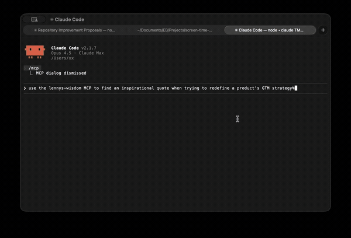

<div align="center">

# 🎙️ Lenny's Podcast Wisdom

**MCP Server for AI-Powered Product Management Insights**

[](https://www.npmjs.com/package/lennys-podcast-wisdom)
[](https://opensource.org/licenses/MIT)

*Query 269 episodes of [Lenny's Podcast](https://www.lennysnewsletter.com/podcast) directly from Claude Code, Cursor, or any MCP-compatible AI assistant.*

> **Credit:** This tool is built on the incredible content from [Lenny Rachitsky's Podcast](https://www.lennysnewsletter.com/podcast) — the #1 podcast for product people. Subscribe to support Lenny's work!



[Installation](#installation) · [Usage](#usage) · [Tools](#tools) · [Examples](#examples)

</div>

---

## Why?

Lenny's Podcast is a goldmine of product management wisdom from leaders at Airbnb, Stripe, Netflix, and more. This MCP server makes that knowledge accessible to AI assistants—so you can get expert advice while writing PRDs, planning roadmaps, or making product decisions.

**No API keys. No LLM costs. Runs locally.**

---

## Installation

```bash
# Install globally
npm install -g lennys-podcast-wisdom

# Add to Claude Code
claude mcp add lennys-wisdom -- lennys-wisdom
```

Or try instantly with npx:

```bash
claude mcp add lennys-wisdom -- npx lennys-podcast-wisdom
```

---

## Usage

Once installed, just ask naturally:

```
"Search Lenny's podcast for advice on product-market fit"
"What does Brian Chesky say about design?"
"Give me random wisdom about leadership"
```

---

## Tools

| Tool | Description |
|------|-------------|
| `search_quotes` | Search 51,000+ transcript segments by keyword |
| `search_quotes_smart` | 3-phase LLM-assisted search for nuanced topics |
| `list_guests` | Browse all 269 guests, filter by name or views |
| `get_episode` | Get episode details, description, YouTube link |
| `random_wisdom` | Get serendipitous inspiration by topic |

---

## Examples

### Search for quotes
```
User: Search for quotes about hiring PMs

Claude: Found 5 quotes about "hiring PMs":

1. **Shreyas Doshi** (The art of product management)
   > "The best PMs I've hired have this quality of being
   > relentlessly resourceful..."
   [Watch at 00:42:15](https://youtube.com/watch?v=...)
```

### Get episode details
```
User: Get episode details for Brian Chesky

Claude: # Brian Chesky's new playbook
**Guest:** Brian Chesky
**Duration:** 1:13:28
**Views:** 381,905
**YouTube:** https://youtube.com/watch?v=4ef0juAMqoE
```

---

## How It Works

```
┌─────────────────┐     MCP Protocol    ┌──────────────────┐
│   Claude Code   │ ◄─────────────────► │  lennys-wisdom   │
│   (or Cursor)   │    Tool Calls       │  (local search)  │
└─────────────────┘                     └──────────────────┘
                                               │
                                               ▼
                                        ┌──────────────┐
                                        │   Lunr.js    │
                                        │  Full-text   │
                                        │   Search     │
                                        └──────────────┘
                                               │
                                               ▼
                                        ┌──────────────┐
                                        │  269 Episode │
                                        │  Transcripts │
                                        └──────────────┘
```

- **Lunr.js** for fast full-text search (no external APIs)
- **51,205 indexed segments** with timestamps
- **YouTube deep links** jump to exact moments

---

## Use Cases

- 📝 **Writing PRDs** — Get frameworks and best practices
- 🗺️ **Product Strategy** — Learn from Airbnb, Stripe, Netflix leaders
- 🎯 **Career Growth** — Advice on leveling up as a PM
- 🤖 **Building Tools** — Power Slack bots, dashboards, or custom apps

---

## Data Source

Transcripts from [ChatPRD/lennys-podcast-transcripts](https://github.com/ChatPRD/lennys-podcast-transcripts).

---

## Automatic Updates

This package stays current automatically:

- **Weekly checks** for new Lenny's Podcast episodes (every Monday)
- **Auto-published** to npm when new transcripts are available
- **No action required** — just run `npm update -g lennys-podcast-wisdom`

[](https://github.com/bluzername/lennys-quotes/actions/workflows/update-transcripts.yml)

---

## License

MIT

---

<div align="center">

**Built with ❤️ for the product community**

</div>
